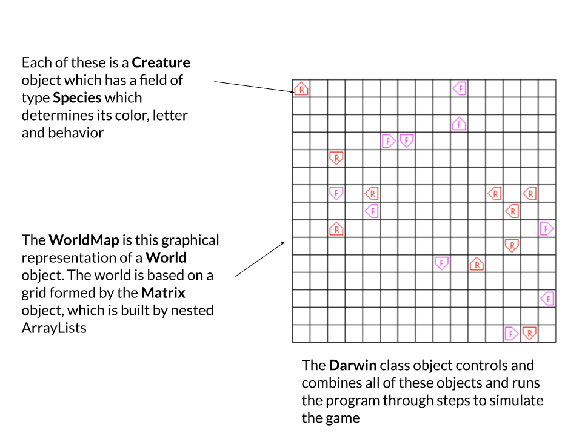

# Assignment - Darwin

### This is a pair assignment where you will work with a partner from your learning community. 

## Learning Goals

* Gain practice writing large, multi-class programs.
* Learn the importance of modular decomposition and information hiding. (The entire program is
broken down into a series of classes that can be developed and tested independently, without revealing
representational details.)
* Have fun with a problem that is algorithmically interesting in its own right!

## Key Terms and Concepts

* `ArrayList` - An ArrayList is a resizable array-like data structure, where items can be added and removed regardless of the initialized size (See 1.3 pg. 136 in the textbook and the lecture slides for more).
* `Matrix` - A grid made of rows and columns, in this case implemented with ArrayLists of ArrayLists.
* Modular decomposition - In this case, the concept of breaking a complex coding problem into individual parts which each serve their own purposes and interlock with each other.

## Description

In this assignment, your job is to build a simulator for a game called Darwin invented by Nick Parlante. You will also create your own creature for this game which will be pitted against other creatures created by your classmates.

The Darwin program simulates a two-dimensional world divided up into small squares and populated by a
number of creatures. Each of the creatures lives in one of the squares, faces in one of the major compass
directions (North, East, South, or West), and belongs to a particular species, which determines how that
creature behaves. For example, one possible world is shown below:

The sample world in the picture above is populated with twenty creatures, ten of a species called Flytrap
and ten of a species called Rover. In each case, the creature is identified in the graphics world with the
first letter in its name, e.g., F for Flytrap. The orientation is indicated by the figure surrounding the identifying letter; 
the creature points in the direction of the arrow. The behavior of each creature–which you can think of as a
small robot–is controlled by a program that is particular to each species. Thus, all of the Rovers behave in
the same way, as do all of the Flytraps, but the behavior of each species is different from the other.

As the simulation proceeds, every creature gets a turn. On its turn, a creature executes a short piece of its
program in which it may look in front of itself to see what's there and then take some action. The possible
actions are moving forward, turning left or right, or infecting some other creature standing immediately
in front, which transforms that creature into a member of the infecting species. As soon as one of these
actions is completed, the turn for that creature ends, and some other creature gets its turn. When every
creature has had a turn, the process begins all over again with each creature taking a second turn, and so on.
The goal of the game is to infect as many creatures as possible to increase the population of your own species.

Please note that we do not dictate exactly the order that creatures take a turn, only that all creatures must take
one turn before the next round begins. From a simulation perspective, the order that creatures take turns could affect the
outcome of the simulation, but pedagogically we are more interested in the high-level interaction, so feel free to choose whatever
is easiest for your implementation.

See **Appendix A - Species Programming** for more on how `Instruction` lists inform creature behavior. 
Make sure you read through and undestand this before coding the `Species` class.

There are several presupplied creature files:

`Food`: This creature spins in a square but never infects anything. Its only purpose is to serve as food for
other creatures. As Nick Parlante explains, "the life of the Food creature is so boring that its only hope
in life is to be eaten by something else so that it gets reincarnated as something more interesting." Pacificts will disagree.

`Hop`: This creature just keeps hopping forward until it reaches a wall. Not very interesting, but it is useful
to see if your program is working.

`Flytrap`: This creature spins in one square, infecting any enemy creature it sees. It can be surprisingly effective.

`Rover`: This creature walks in straight lines until it is blocked, infecting any enemy creature it sees. If it
cannot move forward, it turns.

You should also create your own creature by creating a data file in the format described in **Appendix A**. We will use this creature
in a survival game across all creatures of your classmates.

## Classes

Your goal is to write the Darwin simulator and get it running. The program is large enough that it is
broken down into a number of separate classes that work together to solve the complete problem.

You are responsible for implementing the `Darwin`, `Species`, `Creature`, and `World` classes. Skeletons of these
classes are provided in the starter folder we provide. In addition, we provide you with three helper classes that you
should use without modification: `Instruction`, `Position`, and `WorldMap`. Make sure you understand the purpose and methods of the pre-supplied classes before continuing.

### `Instruction`
This simple class represents one instruction out of the `Species`'s instruction set. This class is already implemented
for you.

### `Position`
This class represents (x,y) points in the world and constants for compass directions. This class is already implemented for you.

### `WorldMap`
This class handles all of the graphics for the simulation. This class is already implemented for you.  They key method in this class is the `displaySquare` method that your creature will need to call to update the visual status of the game.

### `Matrix`
This class represents a two-dimensional square matrix that consists of a specified number of rows and columns. This class is already implemented for you. When you instantiate objects of type `Matrix`, keep in mind that `Matrix` works with generics. In our case, a `Matrix` object will eventually hold `Creature`s, that is `Matrix<Creature>`. The syntax for instantiating a `Matrix` of `Creature`s will be similar to instantiating `ArrayList`s of `Boolean`s, as we saw them in lab1.

### `Species`
This class represents a species, and provides operations for reading in a species description from a file and
for working with the programs that each creature executes. You must fill in some basic methods, as well as a constructor that reads in the instructions from the .txt files in the **Creatures** folder. See **Appendix A - Species Programming** for more on how `Creature`s should behave based on their species.  **Note:** You may assume that the creature file is properly formatted, i.e., that if follows the specification in the appendix and that all of the instructions are valid instructions.

### `Creature`
Objects of this class represent individual creatures, along with operations for creating new creatures and for
taking a turn. You must fill in some basic getter and setter methods for this class, the constructor, and a `takeOneTurn` method which executes instructions from the Creature's Species instructions until it gets to a hop, turn, or infect instruction.

### `World`
This class contains an abstraction for a two-dimensional world, into which you can place the creatures. You must fill in some getter and setter methods for this class, as well as a constructor. Make sure to throw the appropriate exceptions in setters and getters as specified in the JavaDoc. Remember that this is only the abstraction for the grid and should be based on the `Matrix` class. Furthermore, this class does not handle the graphics. The graphics end of the program is already covered by the `WorldMap` class which has been completed for you.

### `Darwin`
This class contains the main program, which is responsible for setting up the world, populating it with
creatures, and running the main loop of the simulation that gives each creature a turn. The details of these
operations are generally handled by the other modules. New creatures should be created in random empty
locations, pointing in random directions.

## Getting started

1. Follow the same steps with the first lab/assignment to clone the github repository for this assignment. You will need to create a team for your teammate(s) to join. If you partner(s) has already created a team, simply join their team. Now you should have a joint GitHub repository that you can both push and pull from. Make sure to do the work on one computer at a time, pushing when you are finished, so that you don't have conflicts. 

2. You can double click on `DarwinTest.jar` to run the sample solution. This will give you a chance to see
how the program is supposed to behave. It should prompt you to open creature files. Select at least
two different creature types. When you are done, click on cancel and the program should commence
running.

1. Write the `World` class. This should be straight-forward if you use the provided `Matrix` class. 
When constructing a world with a speficied width and height, be careful to match the width to the number of columns and height to the number of rows in your `Matrix` object.

2. Test this class thoroughly before proceeding. Use the provided `AutograderCompTest` class (and any additional tests that you think would be helpful) in order to verify and convince yourself that all of the methods work. 

3. Write the `Species` class. The hardest part will be parsing the program file and storing it in the `Species`.
Note that the first instruction of a program is at address 1, not 0. **Test this class thoroughly before
proceeding. Write test cases and verify that all of the methods work.**
See the hints within the starter file for the `Species` class on how to read lines from the files.

5. Fill in the *basic* details of `Creature` class. Implement only enough to create creatures and have them
display themselves on the world map. Implement `takeOneTurn` for the simple instructions (left,
right, go, hop). **Test the basic `Creature` thoroughly before proceeding. Write a `main`
method in that class and verify that all of the methods work**.

6. Begin to implement the simulator in the `Darwin` class. Start by reading a single species and creating
one creature of that species. Write a loop that lets the single creature take 10 or 20 turns.

7. Go back to `Creature` and implement more of the `takeOneTurn` method. Test as you go – implement
an instruction or two, and verify that a `Creature` will behave correctly, using your partially-written
`Darwin` class.

8. Finish up the `Darwin` class. Populate the board with creatures of different species (We suggest about
10 of each kind of creature) and make your `main` simulation loop iterate over the creatures, giving
each a turn. The class should create creatures for the species given as command line arguments to the
program when you run it. See `Darwin.java` for more details. Run the simulation for several hundred
iterations or so. You can always stop the program by pressing `control-C` in the terminal window or
closing the Darwin Window. Make sure you know how to pass in arguments to the `main` method as
the autograder will be passing in command line arguments to run Darwin.
**Please do not change the folder structure! You should keep all creature files in the `Creature`
folder.**

If you want to add command-line arguments in Eclipse, do the following:
- Next to the run button, you can open the run dropdown menu.
- Select "Run Configurations...".
- Under the "Arguments" tab there is a "Program arguments" field where you can enter command-line arguments.
- Enter the names of the files (without quotes) and separated by spaces in this field.

1. Finish testing the implementation by making sure that the creatures interact with each other
correctly. Test `ifenemy`, `infect`, etc.

10. Design and test your own creature for the competition! Think about what it could do to set itself apart and succeed over other creatures.

## Helpful Considerations

* Incremental testing - One of the main advantages of segmented programs, especially object oriented ones, is their ability to be developed and tested piece by piece. Test classes individually, not altogether. This will help you verify that each piece works and avoid a situation where some unknown is broken. What does it take to convince yourself that your code is correct? What edge cases should you make sure to test? How might something break?

* Putting it together - This assignment has many dependencies and moving pieces. This can make it more confusing to understand, but will make it much easier to test and create. Which classes should handle which tasks? How does each piece fit together? Which classes are used by the user and which act as helpers for others? Which method handles what action?

* Writing adaptable code - One big advantage of this program is that more species can be added without hard coding them in. All you need to do is write a .txt file which defines their behavior. This means that your code essentially reads other simple code. How does this benefit your program? Why might this be a helpful general design principle?

## Grading

You will be graded based on the following criteria:

| Criterion                                                                                       | Points |
| :---------------------------------------------------------------------------------------------- | :----- |
| `World`  passes `World` unit tests                                                              | 2      |
| `Species`  passes `Species` unit tests                                                          | 4      |
| `Creature` passes tests                                                                         | 3      |
| `Darwin` correctly runs the game                                                                | 3      |
| General Correctness                                                                             | 3      |
| Appropriate comments + JavaDoc                                                                  | 3      |
| [Style and formatting](https://github.com/pomonacs622019fa/Handouts/blob/master/style_guide.md) | 3      |
| Creature submitted                                                                              | 2      |
| Extra Credit                                                                                    | 2      |

NOTE: Code that does not compile will not be accepted! Make sure that your code compiles before submitting it.

## Two part assignment

This assignment spans two weeks.  However, we will still be grading some of the assignment next week.  Specifically, you must complete and push the `World` and `Species` classes by next Thursday. **The assignment grade portion for these two classes will be based on their status at the end of the day on Thursday**.  You may include other files/changes in your repository.  We will not grade these, but make sure that they compile.  You may change the `World` and `Species` files after Thursday, e.g., if you find a bug that affects the other classes, but we will not grade these changes. The entire program must be submitted by the final deadline.

## Submitting your work

1. All of the work on the project must be done together with your team.
You may not have one person work on it for a while, for example, and then have another student come in
and try to fix errors. Thus, you should make sure that
you can find significant periods of time in which you can work together. Learning community pre-determined meeting times can be a good first step but you need to schedule extra time.

2. Double-check that your work is indeed pushed in Github! It is your responsibility to ensure that you do so before the deadline. Don't forget to commit and push your changes as you go and to edit the provided `json`. In particular, don't forget to put a description of the extra credit if you did extra credit.

3. You must include in your submission a species of your own design in a file named it `lastNameOfFirstStudent_lastNameOfSecondStudent.txt` (or third if you work in teams of three).
It can be as simple or as complex as you like, but must use **only** the instructions specified above for
creatures. The color must also be one of those specified in `WorldMap`. We will pit your creatures against
each other to watch them battle for survival! Prizes will be awarded! Be sure to include your name in
the comments on your species design.

## Extra credit

There are many ways to extend the program to simulate more interesting Species behavior. Here are just a
few ideas if you wish to extend Darwin for extra credit:

1. Give creatures better eyesight. Add `if2enemy n`. This instruction checks if there is an enemy two steps
in front of a creature. This can help make fly traps much more lethal. You could also add peripheral
vision and let creatures see the either side. You can add similar variants for the other tests as well.

2. Give creatures memory. This can be as simple as permitting each creature store a single integer. You
can then add the following instructions to the instruction set: `set n` to set a creature’s memory; `ifeq v n` to jump to address `n` in the program if a creature’s memory contains `v`; and `inc` and `dec` to add and
subtract from memory. None of these instructions should end a turn. You can get more coordinated
activity by using this type of memory.

3. Give creatures the ability to communicate. Once creatures have memory, let them ask the creature
on the square infront of them what is on its mind with the `ifmemeq v n`. This instruction reads the
memory of the creature in the square infront of a creature and jumps to `n` if that value is `v`. You can
also add `copymem` that copies the value in the memory value of the creature infront of you to your own
memory. These instructions permit creatures to form quite successful “phalanx” formations.

4. Make creatures mutate. Perhaps copies of creatures aren’t quite the same as originals— when a creature
infects another creature, make there be a chance that the infected creature will be a mutation of the
infecting creature’s species. This will require creating new Species that are close, but not quite exact,
copies of an existing Species. Taken to its extreme, you can make species evolve over time to become
better and better at surviving in the Darwin world.

5. Implement any other extension you find interesting. The creatures that you will submit to the competition cannot have the extra credit behavior for fairness reasons.

### Appendix A - Species Programming

In order to know what to do on any particular turn, a creature executes some number of instructions in an
internal program specific to its species. For example, the program for the Flytrap species is shown below:

| step | instruction | comment                                  |
| :--- | :---------- | :--------------------------------------- |
| 1    | `ifenemy 4` | If there is an enemy ahead, go to step 4 |
| 2    | `left`      | Turn left                                |
| 3    | `go 1`      | Go back to step 1                        |
| 4    | `infect`    | Infect the adjacent creature             |
| 5    | `go 1`      | Go back to step 1                        |

The step numbers are not part of the actual program, but are included here to make it easier to understand
the program. On its turn, a Flytrap first checks to see if it is facing an enemy creature in the adjacent square.
If so, the program jumps ahead to step 4 and infects the hapless creature that happened to be there. If not,
the program instead goes on to step 2, in which it simply turns left. In either case, the next instruction is a
go instruction that will cause the program to start over again at the beginning of the program.

Programs are executed beginning with the instruction in step 1 and ordinarily continue with each new
instruction in sequence, although this order can be changed by certain instructions in the program. Each
creature is responsible for remembering the number of the next step to be executed. The instructions that
can be part of a Darwin program are listed below:

`hop`: The creature moves forward as long as the square it is facing is empty. If moving forward would put
the creature outside the boundaries of the world or would cause it to land on top of another creature,
the hop instruction does nothing.

`left`: The creature turns left 90 degrees to face in a new direction.

`right`: The creature turns right 90 degrees.

`infect n`: If the square immediately in front of this creature is occupied by a creature of a different species
(an "enemy") that creature is infected to become the same as the infecting species. When a creature
is infected, it keeps its position and orientation, but changes its internal species indicator and begins
executing the same program as the infecting creature, starting at step `n` of the program. The number
`n` is optional. If it is missing, the infected creature should start at step 1.

`ifempty n`: If the square in front of the creature is unoccupied, update the next instruction field in the
creature so that the program continues from step `n`. If that square is occupied or outside the world
boundary, go on with the next instruction in sequence.

`ifwall n`: If the creature is facing the border of the world (which we imagine as consisting of a huge wall)
jump to step `n`; otherwise, go on with the next instruction in sequence.

`ifsame n`: If the square the creature is facing is occupied by a creature of the same species, jump to step `n`;
otherwise, go on with the next instruction.

`ifenemy n`: If the square the creature is facing is occupied by a creature of an enemy species, jump to step
`n`; otherwise, go on with the next instruction.

`ifrandom n`: In order to make it possible to write some creatures capable of exercising what might be called
the rudiments of “free will,” this instruction jumps to step `n` half the time and continues with the next
instruction the other half of the time.

`go n`: This instruction always jumps to step `n`, independent of any condition.

A creature can execute any number of if or go instructions without relinquishing its turn. The turn ends
only when the program executes one of the instructions `hop`, `left`, `right`, or `infect`. On subsequent turns,
the program starts up from the point in the program at which it ended its previous turn.

The program for each species is stored in a file in the subfolder named `Creatures` in the assignment folder.
Each file in that folder consists of the species name and color, followed by the steps in the species program,
in order. The program ends with an empty line. Comments may appear after the blank line or at the end
of each instruction line. For example, the program file for the Flytrap creature looks like this:

    Flytrap
    magenta
    ifenemy 4
    left
    go 1
    infect
    go 1
    
    The flytrap sits in one place and spins.
    It infects anything which comes in front.
    Flytraps do well when they clump.
